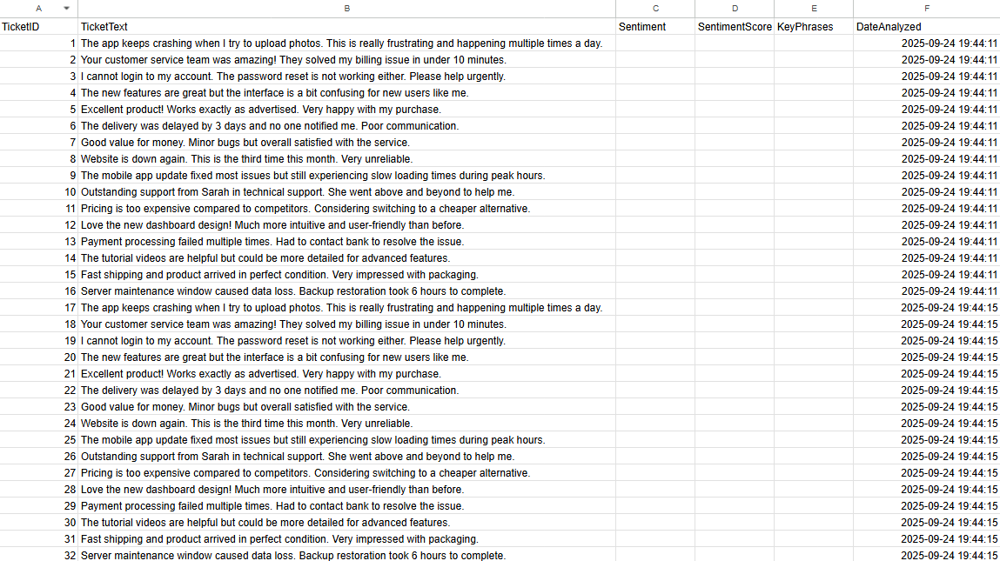

# Azure AI + Power BI Customer Sentiment Analysis

## Overview

This project demonstrates an end-to-end automated customer support ticket analysis system using Azure cloud services. The solution automatically processes customer support tickets, performs sentiment analysis using AI, and visualizes insights through interactive Power BI dashboards.

**Business Problem:** Customer support teams receive hundreds of tickets daily, making it impossible to manually assess customer sentiment and identify pain points quickly.

**Solution:** Automated pipeline that analyzes ticket sentiment in real-time and provides visual dashboards for immediate business insights.

## Architecture

```
Customer Tickets → Azure SQL Database → Logic Apps (Scheduler) → Azure AI Language Service → Updated Database → Power BI Dashboard
```

### Components:
- **Azure AI Language Service**: Performs sentiment analysis and key phrase extraction
- **Azure SQL Database**: Stores ticket data and AI analysis results  
- **Azure Logic Apps**: Orchestrates the automation workflow (runs every 5 minutes)
- **Power BI**: Creates interactive dashboards for business users

## Technologies Used

- **Azure AI Language Service** - Sentiment analysis and text analytics
- **Azure SQL Database** - Data storage and management
- **Azure Logic Apps** - Workflow automation and orchestration
- **Power BI Desktop** - Data visualization and reporting
- **SQL Server** - Database queries and data manipulation

## Key Features

- **Real-time Processing**: Automated analysis every 5 minutes
- **Scalable Architecture**: Handles growing ticket volumes automatically  
- **Sentiment Analysis**: Identifies positive, negative, mixed, and neutral sentiments
- **Confidence Scoring**: Provides AI confidence levels for each analysis
- **Visual Dashboard**: Color-coded charts for immediate insight recognition
- **Historical Tracking**: Maintains complete audit trail of all analyses

## Sample Results

The system processes customer tickets like:
> "The app keeps crashing when I try to upload photos. This is really frustrating and happening multiple times a day."

**AI Analysis Output:**
- **Sentiment**: Negative
- **Confidence**: 100%
- **Key Phrases**: "app crashing", "upload photos", "frustrating"

## Dashboard Features

Power BI dashboard includes:
- **Sentiment Distribution**: Bar chart showing ticket counts by sentiment type
- **Color Coding**: Red (negative), Green (positive), Yellow (mixed), Gray (neutral)
- **Confidence Scores**: Analysis reliability indicators
- **Time Trends**: Sentiment patterns over time
- **Key Issues**: Most common complaint categories

## Business Value

- **Instant Insights**: Identify customer pain points without manual review
- **Proactive Support**: Address negative sentiment trends before they escalate  
- **Resource Allocation**: Focus support resources on high-impact issues
- **Performance Tracking**: Monitor customer satisfaction trends over time
- **Scalability**: Handles increasing ticket volumes without additional manual effort

## Screenshots - Implementation Workflow

### 1. Azure AI Language Service Setup

*Azure AI Language Service configured with free tier (5,000 API calls/month) in East US region for text analytics and sentiment analysis.*

### 2. Azure Resource Group Overview  

*Complete Azure architecture showing all integrated services: AI Language Service, SQL Database, Logic Apps, and supporting components across regions.*

### 3. AI Sentiment Analysis Testing

*Language Studio demonstrating real-time sentiment analysis on customer support ticket with 100% confidence negative sentiment detection and detailed sentence-level breakdown.*

### 4. Logic Apps Automation Workflow

*Complete automated workflow: Recurrence trigger → SQL query → For Each loop → HTTP AI analysis → Database update. Processes all unprocessed tickets every 5 minutes.*

### 5. Database Before AI Processing

*Raw customer support tickets in SQL database showing original ticket text without sentiment analysis - the starting point for AI processing.*

### 6. Database After AI Processing  

*Same tickets after automated AI processing, now populated with sentiment classifications, confidence scores, key phrases, and analysis timestamps.*

### 7. Power BI Dashboard - Final Results

*Interactive Power BI dashboard with color-coded sentiment analysis: Red (negative), Green (positive), Yellow (mixed), Gray (neutral) showing clear business insights.*

## Project Structure

```
azure-ai-powerbi-sentiment-analysis/
├── README.md                          # Project documentation
├── screenshots/                       # Visual documentation
│   ├── 01-language-service-overview.png    # Azure AI Language Service setup
│   ├── 02-azure-resources-overview.png     # Complete resource architecture  
│   ├── 03-language-studio-analysis.png     # AI sentiment analysis demo
│   ├── 04-logic-apps-workflow.png         # Automation workflow design
│   ├── 05-database-before-processing.png   # Raw ticket data
│   ├── 06-database-after-processing.png    # AI-processed results
│   └── 07-powerbi-sentiment-dashboard.png  # Final visualization
├── sql-scripts/                       # Database setup
│   ├── create-table.sql              # Table schema creation
│   ├── sample-data.sql               # Test ticket data
│   └── clear-analysis.sql            # Reset analysis data
├── logic-apps/                       # Automation workflow
│   └── workflow-definition.json      # Logic Apps configuration
└── docs/                             # Additional documentation
    └── deployment-guide.md           # Step-by-step setup
```

## Implementation Highlights

### Database Schema
```sql
CREATE TABLE CustomerTickets (
    TicketID INT IDENTITY(1,1) PRIMARY KEY,
    TicketText NVARCHAR(MAX),
    Sentiment NVARCHAR(50),
    SentimentScore FLOAT,
    KeyPhrases NVARCHAR(MAX),
    DateAnalyzed DATETIME2 DEFAULT GETDATE()
);
```

### Logic Apps Workflow
1. **Recurrence Trigger**: Runs every 5 minutes
2. **SQL Query**: Finds unprocessed tickets (`WHERE Sentiment IS NULL`)
3. **For Each Loop**: Processes multiple tickets individually
4. **HTTP Request**: Calls Azure AI Language Service API
5. **Database Update**: Stores AI results back to SQL

### API Integration
The system integrates with Azure AI Language Service using REST API calls:
- **Endpoint**: `/text/analytics/v3.1/sentiment`
- **Authentication**: Subscription key-based
- **Input**: JSON with ticket text
- **Output**: Sentiment classification with confidence scores

## Cost Efficiency

Using Azure's free tiers for development/demo:
- **Language Service**: 5,000 free API calls per month
- **Logic Apps**: 4,000 free executions per month  
- **SQL Database**: Free tier with 32GB storage
- **Power BI**: Free desktop version

## Technical Skills Demonstrated

- **Cloud Architecture**: Multi-service Azure integration
- **API Integration**: RESTful service consumption
- **Workflow Automation**: Logic Apps orchestration
- **Data Pipeline Design**: ETL processes with real-time updates
- **Business Intelligence**: Dashboard creation and data visualization
- **Database Management**: SQL Server operations and optimization
- **AI/ML Integration**: Cognitive services implementation

## Potential Enhancements

- **Custom Text Classification**: Train models for specific issue categories
- **Email Integration**: Direct ticket ingestion from support email systems
- **Alert System**: Automatic notifications for negative sentiment spikes
- **Advanced Analytics**: Trend analysis and predictive insights
- **Multi-language Support**: Process tickets in different languages
- **Power BI Service**: Published dashboards for team access

## Learning Outcomes

This project demonstrates practical experience with:
- Azure cloud service integration
- AI/ML service implementation in business contexts
- Automated workflow design and deployment
- Data visualization and business intelligence
- End-to-end solution architecture

## Note

This repository contains the complete project structure and documentation. The actual Azure resources were created for demonstration purposes and have been deleted to avoid ongoing costs. All configuration files and scripts are included for reference and potential recreation.

---

**Disclaimer**: This project was built for educational and portfolio demonstration purposes. Sensitive information such as API keys and connection strings have been removed from all configuration files.